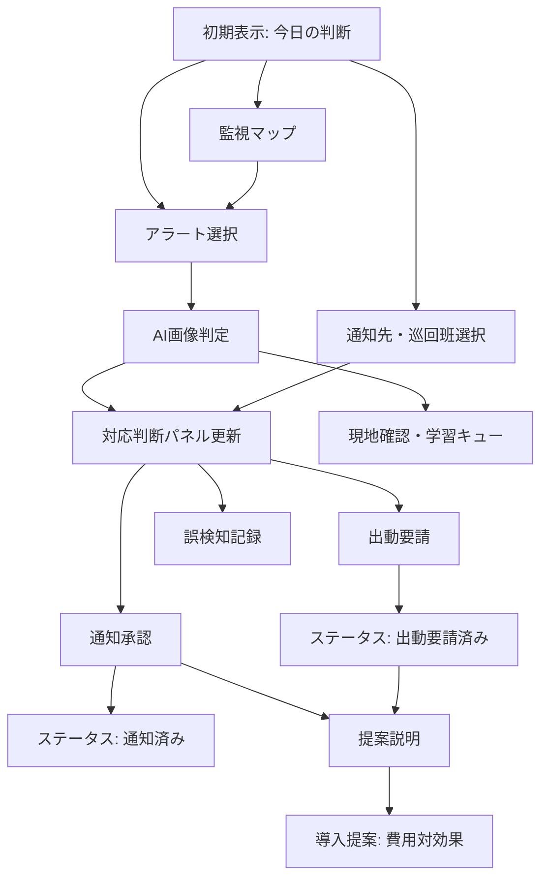

# クマ早期警戒・対応支援システム 画面遷移・操作仕様書

作成日: 2026-06-05  
対象: `bear-early-warning-demo`  
関連資料: `docs/site-spec.md`

## 1. 前提

本サイトは、複数URLを移動する通常のWebサイトではなく、React + Viteで構築された単一画面アプリである。

そのため、多くのボタンは別ページへ遷移するのではなく、同じ画面内で以下を行う。

- 表示状態を切り替える
- 選択中データを変更する
- タイムラインに疑似ログを追加する
- ステータスを変更する
- 指定セクションへスクロールする

## 2. 技術上の画面構造

### 2.1 フレームワーク

| 項目 | 内容 |
|---|---|
| UIライブラリ | React |
| ビルドツール | Vite |
| アイコン | lucide-react |
| ルーティング | ハッシュルーティング |
| データ保存 | タイムラインをブラウザの `localStorage` に保存 |
| API接続 | なし |
| 状態管理 | React `useState` / `useMemo` |

### 2.2 画面遷移の考え方

現状は本格的なURLルーターは使っていないが、`#/alerts` のようなハッシュURLで画面IDを共有できる。

画面IDは内部状態 `activeNav` とURLハッシュの両方で管理する。

| 画面ID | 表示名 | 現在の役割 |
|---|---|---|
| `dashboard` | 今日の判断 | 初期表示、全体判断画面 |
| `alerts` | アラート確認 | 承認待ちアラート確認 |
| `monitor` | 監視マップ | 監視マップ、機器状態の確認 |
| `field` | 現場連携 | 通知先、巡回班の確認 |
| `proposal` | 導入提案 | 営業・予算説明セクション |

補足:

- `alerts` は承認待ちアラートへスクロールする。
- `monitor` は監視マップへスクロールする。
- `field` は現場連携セクションへスクロールする。
- `proposal` は導入提案セクションへスクロールし、費用対効果タブを表示する。

## 3. 主要状態

| 状態名 | 初期値 | 意味 |
|---|---|---|
| `alertItems` | サンプルアラート一覧 | アラート一覧と各アラートの操作状態 |
| `selectedId` | `YK-260605-01` | 選択中アラートID |
| `visionItems` | サンプル画像AI判定一覧 | 固定カメラ、ドローン、熱源画像のAI判定状態 |
| `selectedVisionId` | `VIS-A12-001` | 選択中の画像AI判定ID |
| `recipients` | 通知先サンプル | 通知先の選択状態 |
| `timeline` | 初期タイムライン | 操作履歴の疑似ログ |
| `proposal` | `pilot` | 導入提案タブの選択状態 |
| `activeNav` | `dashboard` | 左メニューの選択状態 |
| `mapZoom` | `100` | 地図倍率 |
| `selectedMaterial` | `実証計画サマリー` | 提案資料の選択状態 |
| `mode` | `map` | 地図 / 航空写真の表示切替 |
| `notice` | `承認待ちの警戒情報があります` | 画面上の補足通知 |
| `alertFilter` | `all` | アラート絞り込み条件 |
| `selectedPatrolTeam` | `北部巡回隊` | 選択中の巡回班 |
| `demoMode` | `staff` | 職員向け、首長向け、議会向けの説明モード |
| `pendingAction` | `null` | 確認モーダルで承認待ちの操作 |

## 4. 左メニュー操作

| ボタン | 押下後の状態 | 画面上の変化 | 備考 |
|---|---|---|---|
| 今日の判断 | `activeNav = dashboard` | 今日の判断が選択状態になる。タイムラインに選択ログを追加 | 初期表示と同じ |
| アラート確認 | `activeNav = alerts`, `selectedId = 先頭アラート`, URL `#/alerts` | 承認待ちアラートへスクロール。アラート確認が選択状態になる | 通知アイコンからも同じ動作 |
| 監視マップ | `activeNav = monitor`, URL `#/monitor` | 監視マップへスクロール。タイムラインに機器状態確認ログを追加 | 直接URL共有可 |
| 現場連携 | `activeNav = field`, URL `#/field` | 現場連携セクションへスクロール。タイムラインに巡回班確認ログを追加 | 直接URL共有可 |
| 導入提案 | `activeNav = proposal`, `proposal = roi` | 導入提案が選択状態になり、費用対効果セクションへスクロール | 営業説明用の主要導線 |

## 5. トップバー操作

| 操作 | 押下後の状態 | 画面上の変化 |
|---|---|---|
| 通知アイコン | `activeNav = alerts`, `selectedId = 先頭アラート` | アラート確認状態へ切り替え |
| ヘルプアイコン | `notice` 更新、`timeline` 追加 | 「AIは候補検知、人間が最終承認する運用です」という説明ログを追加 |
| 操作者表示 | なし | 現状は表示のみ。ドロップダウン動作は未実装 |

## 5.1 説明モード操作

| ボタン | 押下後の状態 | 表示変化 |
|---|---|---|
| 職員向け | `demoMode = staff` | 現場運用デモの説明文を表示 |
| 首長向け | `demoMode = executive`, `proposal = roi` | 意思決定デモの説明文を表示。費用対効果説明に進みやすくする |
| 議会向け | `demoMode = council`, `proposal = materials` | 予算説明デモの説明文を表示。提案資料説明に進みやすくする |

## 6. 対応操作バー

画面上部にある主要操作バー。

| ボタン | 有効条件 | 押下後の状態 | 表示変化 |
|---|---|---|---|
| 通知承認 | `selected.notified` と `selected.falsePositive` が false | 確認モーダルを表示。確定後、選択中アラートに `notified = true` を付与 | ボタン文言が「通知済み」に変わる。ステータスが通知済みになる。タイムラインに「住民通知を承認しました」を追加 |
| 出動要請 | `selected.patrolRequested` と `selected.falsePositive` が false | 確認モーダルを表示。確定後、選択中アラートに `patrolRequested = true` を付与 | ボタン文言が「要請済み」に変わる。ステータスが通知済み・出動要請済みになる。タイムラインに「パトロール出動を要請しました」を追加 |
| 提案説明 | 常時有効 | `activeNav = proposal`, `proposal = roi` | 導入提案セクションへスクロールし、費用対効果タブを表示 |

## 7. 状況カード

| 表示 | 操作 | 備考 |
|---|---|---|
| 今すぐ承認 | なし | 表示専用 |
| 最高リスク | なし | 表示専用 |
| 次の操作 | なし | 表示専用 |

今後の改善案:

- 「今すぐ承認」カードをクリックすると承認待ちアラートへスクロール
- 「最高リスク」カードをクリックすると最高リスクのアラートを選択
- 「次の操作」カードをクリックすると対応操作バーまたは判断パネルへフォーカス

## 8. 承認待ちアラート操作

### 8.1 絞り込みボタン

| ボタン | 押下後の状態 | 表示変化 |
|---|---|---|
| すべて | `alertFilter = all` | 全アラートを表示 |
| 承認待ち | `alertFilter = approval` | 承認待ちのアラートを表示 |
| 高リスク | `alertFilter = critical` | レベル4以上のアラートを表示 |
| 現地確認 | `alertFilter = field` | 現地確認が必要なアラートを表示 |

共通動作:

- 押下した絞り込みボタンが選択状態になる
- タイムラインに絞り込みログを追加
- 該当アラートがない場合は空状態を表示

### 8.2 アラートカード

| 操作 | 押下後の状態 | 表示変化 |
|---|---|---|
| アラートカードを押す | `selectedId = 対象アラートID` | 選択中カードが強調表示。対応判断パネル、操作バー、地図の選択地点が更新される |

紐づく画像AI判定がある場合は `selectedVisionId` も同時に更新される。

## 9. 監視マップ操作

### 9.1 表示切替

| ボタン | 押下後の状態 | 表示変化 |
|---|---|---|
| 地図 | `mode = map` | 通常地図表示。タイムラインに地図表示ログを追加 |
| 航空写真 | `mode = photo` | 航空写真風表示。タイムラインに航空写真表示ログを追加 |

### 9.2 地図マーカー

| 操作 | 押下後の状態 | 表示変化 |
|---|---|---|
| 出没候補マーカーを押す | `selectedId = 対象アラートID` | 対象アラートが選択され、対応判断パネルと操作バーが更新される |

### 9.3 地図操作ボタン

| ボタン | 押下後の状態 | 表示変化 |
|---|---|---|
| 拡大 | `mapZoom` を最大150まで +10 | 地図が拡大される |
| 縮小 | `mapZoom` を最小80まで -10 | 地図が縮小される |
| 中央に戻す | `mapZoom = 100` | 地図倍率が100%に戻る |

## 10. 対応判断パネル操作

| ボタン | 有効条件 | 押下後の状態 | 表示変化 |
|---|---|---|---|
| 住民通知を承認 | `notified = false`, `falsePositive = false` | 確認モーダルを表示。確定後 `notified = true` | ボタンが「通知済み」に変化。ステータス更新。タイムライン追加 |
| パトロール出動要請 | `patrolRequested = false`, `falsePositive = false` | 確認モーダルを表示。確定後 `patrolRequested = true` | ボタンが「出動要請済み」に変化。ステータス更新。タイムライン追加 |
| 誤検知として記録 | `falsePositive = false`, `notified = false`, `patrolRequested = false` | 確認モーダルを表示。確定後 `falsePositive = true` | ボタンが「誤検知記録済み」に変化。ステータス更新。タイムライン追加 |

補足:

- 通知済み、出動要請済み、誤検知状態になると、該当ボタンは無効化される。
- 通知承認後は誤検知記録ボタンが無効化される。
- 誤検知記録後は通知承認、出動要請が無効化される。

## 11. AI画像判定

固定カメラ、ドローン、熱源画像のAI判定結果を表示する。

| 操作 | 押下後の状態 | 表示変化 |
|---|---|---|
| 解析済み画像ボタン | `selectedVisionId = 対象画像ID`, `selectedId = 対象アラートID` | 画像、検出枠、分類候補、対応判断パネルが更新される。タイムラインに画像表示ログを追加 |
| クマとして確認 | 対象 `vision.status = confirmed`。対象アラートの根拠へ画像AI確認済みを追加 | 判定状態が職員確認済みになり、タイムラインに「画像AIでクマ候補を確認しました」を追加 |
| 現地確認へ | 対象 `vision.status = field`。対象アラートの `status = watch` | 判定状態が現地確認候補になり、タイムラインに現地確認ログを追加 |
| 学習キューへ | 対象 `vision.status = false_positive`。対象アラートの `falsePositive = true` | 判定状態が学習キューになり、対象アラートは誤検知扱いになる |

補足:

- 画像AIは候補検知であり、住民通知や出動の最終判断は別途職員が行う。
- ドローン画像は常時監視ではなく、通報後や許可範囲内の現地確認支援として扱う。
- 学習キューへ回した画像は、本番ではAIモデル改善用の教師データ候補になる。

## 12. 証拠・記録

| 操作 | 押下後の状態 | 表示変化 |
|---|---|---|
| 最新5件 | `timeline` 追加 | 証拠一覧確認ログを追加 |
| 証拠カード | `selectedId = 対象アラートID` | 対応判断パネル、操作バー、地図の選択状態を更新 |

## 13. 対応履歴・タイムライン

| 操作 | 押下後の状態 | 表示変化 |
|---|---|---|
| ログ追加済み | `timeline` 追加 | タイムライン確認ログを追加 |

タイムライン項目自体は表示専用。

## 14. 通知先

| 操作 | 押下後の状態 | 表示変化 |
|---|---|---|
| 通知先チェックボックス | 対象 `recipient.checked` を反転 | 選択数が更新される。操作バーと通知文プレビューの宛先数も更新される。タイムラインに追加/解除ログを追加 |
| パネル右上の選択数ボタン | `activeNav = field` | 現場連携状態へ切り替え |

## 15. 巡回班候補

| 操作 | 押下後の状態 | 表示変化 |
|---|---|---|
| 巡回班ボタン | `selectedPatrolTeam = 対象班名` | 選択中の巡回班が強調される。操作バー、通知文プレビューに反映。タイムラインに候補班ログを追加 |
| パネル右上の巡回班ボタン | `activeNav = field` | 現場連携状態へ切り替え |

## 16. 機器稼働状況

| 操作 | 押下後の状態 | 表示変化 |
|---|---|---|
| 監視中 | `activeNav = monitor` | 監視マップ状態へ切り替え。タイムラインに機器状態確認ログを追加 |

機器行自体は表示専用。

## 17. 導入提案セクション

### 17.1 提案タブ

| タブ | 押下後の状態 | 表示変化 |
|---|---|---|
| 実証計画 | `proposal = pilot` | 実証計画パネルを表示 |
| 費用対効果 | `proposal = roi` | 費用対効果パネルを表示 |
| 導入ステップ | `proposal = rollout` | 導入ステップパネルを表示 |
| 提案資料 | `proposal = materials` | 提案資料パネルを表示 |

共通動作:

- 選択中タブが強調される
- タイムラインに提案パネル切替ログを追加

### 17.2 提案資料カード

| 操作 | 押下後の状態 | 表示変化 |
|---|---|---|
| 資料項目を見る | `selectedMaterial = 対象資料名` | 対象ボタンが選択状態になる。タイムラインに資料選択ログを追加 |

## 18. 状態別ステータス表示

| 条件 | 表示ステータス |
|---|---|
| `falsePositive = true` | 誤検知記録済み |
| `notified = true` かつ `patrolRequested = true` | 通知済み・出動要請済み |
| `notified = true` | 通知済み |
| `patrolRequested = true` | 出動要請済み |
| `status = review` | 人間承認待ち |
| `status = ready` | 承認待ち |
| `status = watch` | 再確認中 |
| `status = low` | 通知保留 |

## 19. 画面遷移図

## 20. 現状の仕様上の弱点

現時点の仕様として、以下はまだブラッシュアップ余地がある。

| 項目 | 現状 | 改善案 |
|---|---|---|
| URLルーティング | ハッシュURLのみ | 本番では `/alerts`, `/monitor`, `/proposal` などの通常ルートを追加 |
| 操作確認 | 確認モーダルあり | 本番では送信先、権限、二重承認を含める |
| 操作ログ | ブラウザ内保存 | DB保存の監査ログへ変更 |
| 通知送信 | 未実装 | テスト送信、本番送信を分離 |
| 権限管理 | 未実装 | 危機管理課、農林課、閲覧者などに分離 |
| 画像AI | 疑似データ表示 | 実AIモデル、画像保存、教師データ管理を追加 |
| ドローン | 画像判定デモのみ | 飛行計画、許可範囲、運用責任者を管理 |
| 提案導線 | 説明モード切替あり | 営業台本と画面状態を連動させる |

## 21. 次回改善で優先すべきこと

優先度順:

1. 画像AI推論APIの試作を追加し、アップロード画像を実際に判定する
2. 通知承認、出動要請、誤検知記録の確認モーダルに送信先一覧と責任者名を表示する
3. 通常URLルーティングを追加し、`/alerts` などのURLで直接開けるようにする
4. 営業台本とデモモードを連動させ、説明順に自動スクロールできるようにする
5. 操作ログを簡易DBまたはバックエンドへ保存する
6. 本番化を見据えてAPI仕様書とDB設計書を別紙化する
7. 認証、権限、監査ログの詳細設計を追加する
